# stackv2-thing-in training session-03-2023
Thing'in the future training session for stackv2 

This training material will go through the basics of using Thing'in portal and Thing'in REST API
using a premade Postman collection and/or programmatic interfaces. 
It consists of 2 parts:
- Introduction (~2.5 hours) : basic usage of the portal and the API, along with data and query examples for simple use cases
- Hands-on use case (~2-3 hours) where attendants will construct a graph together using the knowledge from part 1. This part also covers security aspects and a few more advanced functionalities of the API.

## Agenda and outline of this document
1. Reminder: Thing'in data exchange formats and query languages
2. Part 1
   - 1.1. Importing the Postman collection and connecting to the platform (15 min)
   - 1.2. Creation of a dataset using Building Topology Ontology (BOT) (~45min)
       * Creation of the dataset
       * Injection of the dataset on the Thing in platform
   - 1.3. Queries on various dataset (~1h15)
       * Presentation of the query wizard 
       * Query the dataset, with wizard and with swagger or postman
       * Select queries
       * Update queries
       * Aggregation queries
       * Geographic queries
3. Part 2 (~2h)
  - 2.1. Part 2: problem statement (~10min)
  - 2.2. Part 2: questions/assignments (~1h30)
  - 2.3. Part 2: additional material - Blob management (~10min)
  - 2.4. Part 2: additional material - Injecting "massive" datasets (with presentation of building injector IFC + topology), (~10min)
  - 2.5. Part 2: additional material - Digital Twin synchronization (~5min)
    
    
## 1. Thing'in data exchange formats and query languages

### Summary of data management in Thing'in (Avatars/Digital Twin, relationships, data model)
Here are the main things to remember when manipulating `Digital Twins` in Thing'in:
- The term `Digital` Twin is interchangeable with the term `Avatar`
- A `Digital Twin` in Thing'in refers to a node in a global graph
- A `Digital Twin` has a global,shareable identifier, named `iri`, e.g. `http://www.stackv2.com/training-test/green-user-1`
- A `Digital Twin` has an internal identifier, named `uuid`, e.g. `63727326-ac66-4101-a79f-5c4c93a5da65`
- Both `iri` and `uuid` can be used to refer to the `Digital Twin`, (for example to query and retrieve it).
- The `uuid` is generated from the `iri` by Thing'in server. It is consistent in time even when you delete and recreated a `Digital Twin`. 
- Before creating `Digital Twins`, users should create a `Domain`
- A `Digital Twin` belongs to one and only one `Domain`.
- The `Domain` also has an `iri`
- All `ìris` of `avatars`/`Digital Twins` in a domain start with the `Domain` `ìri` (think about it as the domain iri being a prefix).
- All `Digital Twin` should have one or more `classes` (they can be multi-typed)
  - In RDF, this class is defined using the rdf:type relationship
  - In JSON, the `_classes` field of the `Digital Twin` serves as a reference to hold all classes from ontologies
  - Alternatively, the `_labels` field of the twin can be used to reference a user-defined class (a.k.a label), cf. data model information below this paragraph

Here are the main thingins to remember when manipulating relationships:
- Relationships between `Digital Twins` are first class citizen, and can be created, modified, deleted in a similar way
- Relationships are also called `object property`, when they are based on an ontology
- Relationships also have a '_class_'. This class is either the object property used in RDF formats, or the `label` field when using JSON 

Finally, here are the main things to consider in terms of data model:
- Ontologies can be used to model your data. This has many benefits:
  - Using already available data models / standard models
  - Sharing your data model / constructing your data model with partners in a coherent way
  - Adding rules to your model and check that your data complies with those rules
- Alternatively, user-defined classes/properties/relationships can be used. There are advantages to this approach:
  - Fast way to make a simple model and prototype
  - Simpler to read for humans

Thorough the document we will use a common notation from the semantic web `ontologyPrefix:OntologyElement`.
Each time you encounter this notation, this means the prefix corresponds to a fully named ontology (e.g. https://w3id.org/bot#)

### Summary of data exchange formats
Thing'in provides a wide variety of data exchange formats/syntaxes, both in input to Thing'in (i.e. data creation), and output (i.e. querying/data retrieval).
However we can divide these formats in two categories : the [JSON-based syntaxes](https://wiki.thinginthefuture.com/en/public/Manipulate_Avatars), and the [semantic web syntaxes](https://wiki.thinginthefuture.com/en/public/Avatar_tutorial) based on RDF.


### Query languages

Thing'in provides 1 main query language, [Thing'in QL](https://wiki.thinginthefuture.com/en/public/Avatars_search), which is a proprietary, document-oriented query language akin to MongoDB's query language.
Thing'in provides 1 alternative query language, [Cypher](https://wiki.thinginthefuture.com/en/public/CypherForThinginQuery), which is a subset of the [Neo4J Cypher](https://fr.wikipedia.org/wiki/Cypher_(langage)) query language
Internally, both queries are translated to the database native query language (ArangoDB).
Thing'in provides an additional time-specific query language, [TCypher](https://wiki.thinginthefuture.com/en/public/Historization), when domains are historized (this will not be covered in this training material).


## Part 1: Introduction 

This tutorial / hands-on session covers a few basics required to use Thing'In the future APIs, as well as some more advanced examples.
For all elements of this tutorial, and for your future experience with Thing'In the future, you can refer to the documentation/Wiki : https://wiki.thinginthefuture.com/. 

### Postman

To go through this hands-on session you can either use a preconfigured set of requests given in the attached Postman collection, or the swagger interface / thingin portal. 

#### Importing the postman collection 

If you choose to use the Postman collection, the import procedure is simple:
After cloning / downloading this repository, locate the postman collection file (.json) on your system (The collection is located on the github repository under /postman). 

Then, in postman, go to 
> File -> import

And choose the preconfigured collection.

#### Settings up requests in the following sections of the tutorial

In the examples below, when using the swagger/portal you have to replace the variable <yourname> with 
a string with no spaces or special characters, e.g. "thassan". You have to do this wherever "<yourname>" appears (in the query payloads).

When using Postman, you first must make sure you have an environment to set variables in it. 
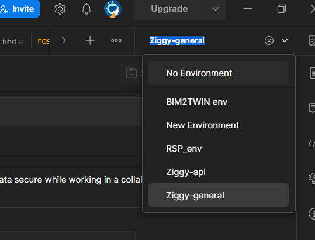


Then you have to set an environment variable in your Postman Environment **once**:
Go to
> Environments
	
and add a row : under **VARIABLE**, write **yourname**, and under **CURRENT VALUE**, 
set it with a string of your choice, the string must have no spaces or special characters, e.g. "thassan".


#### Setting up connection to ThingIn  
    
Go to Thing'in technical portal:
https://tech2.thinginthefuture.com/ 

You should arrive on this landing page. The data presented may vary (a random sample query on Paris opendata is presented). 
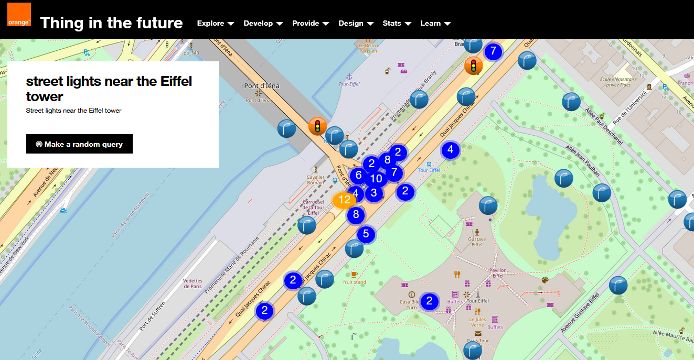

To setup your connection to Thing'in, use the credentials provided at in the session (or your own credentials if you have an account already). 

Instructions for Swagger/portal :
After logging in through the portal, you have to use a TOKEN to use the APIs. This is a simple two-step process
	- click on Develop (on top) -> Get My Thingin Token -> Copy to clipboard for swagger Usage 
	- In the swagger interface,  before sending queries, do this step once : click on authorize ->  paster your token under " bearerAuth  (http, Bearer) Thing'in token (without Bearer keyword)"

 
- To get your token : Top panel -> Develop -> Get My Thing in token -> Copy to Clipboard

	
Instructions for Postman, go to: 
> Part 1/Login & Token/get developper TOKEN. 

You have to fill the Authorization with basic authentication (login password) using the credentials given to you, then send the request
    
To ensure that the following Postman requests are well configured, go to:
> Part 1/Login & Token/batchPostavatars TEST TOKEN

You have to fill in the payload (Body), then send the request. The response code should be a 201. If you have a bad character error, you might not have configured the <yourname> variable. 
    
**You don't have to do any additional steps for the other queries to use your credentials, it is filled automatically**
This is because the get TOKEN query runs a script to set the Token you got as a variable:
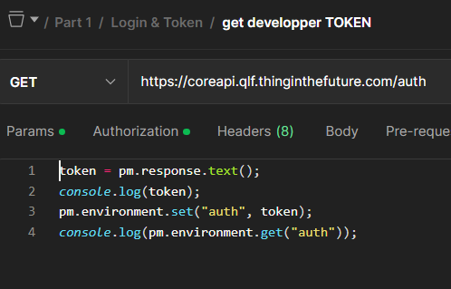

Then the following queries reuse this variable in the authorization header, so you don't have to set it manually each time.
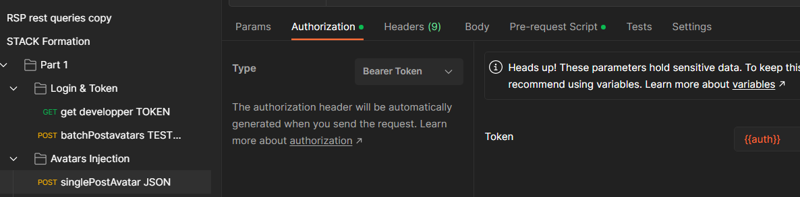


#### Bot Ontology

To get acquainted with Thing'in APIs and data manipulation, we will use predefined schemas, first using the BOT ontology
(Building Topology Ontology) https://w3c-lbd-cg.github.io/bot/


#### Mandatory properties

Each avatar have two mandatory properties:
* **__iri_**: the identifier ot the avatar (Inernational Ressource Identifier)
> ex: "__iri_": "http://stackv2.com/training/simpleBuilding/Room_A_1"

* **__classes_**: list of ontology classes. The avatar is an instance of each of these classes. An avatar have at least one class
> ex: "__classes": ["https://w3id.org/bot#Space"]

To multi-type an entity, simply add classes to the array:
> ex: "__classes": ["https://w3id.org/bot#Space", "http://purl.oclc.org/NET/ssnx/ssn#Device"]

As stated in the outline/reminder : the good practice before inserting avatars is to create their Domain.
Domains can be seen as container. For this session to simplify things, we will let Thing'in create 
the domain automatically based on the **__iri_** of an avatar.


For example, with the avatar above the following domain will be created:
> ex: "__domain":"http://stackv2.com/training/simpleBuilding/"

If we create a second avatar which iri follows the same prefix ("http://stackv2.com/training/simpleBuilding/"), then the avatar is stored in the same domain.
> ex: "__iri_": "http://stackv2.com/training/simpleBuilding/Room_A_2", is in the same domain than: "__iri_": "http://stackv2.com/training/simpleBuilding/Room_A_1"

Using the Bot ontology, try to create the following:
- 1 bot:Building node
- 2 bot:Storey node
- 4 bot:Space nodes (2 spaces per Storey)
- Link each bot:Storey nodes with 2 bot:Space (bot:Storey -hasSpace-> bot:Space)
- Link the bot:Building node with the storeys (bot:Building -hasStorey-> bot:Storey)

Graphically, the resulting structure should look like this:

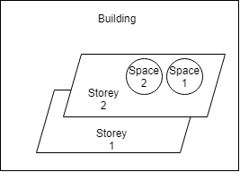

Reminder : there are two possibles formats RDF syntaxes or JSON.
Go through the examples bellow to familiarize yourself with each. For this session we will only use 
[Turtle](https://fr.wikipedia.org/wiki/Turtle_(syntaxe)) variant of the RDF syntax is used.

Each attendant will create data in his own domain named `http://stackv2.com/training/simpleBuilding/<yourname>/` where 
`<yourname>` is a variable that you should replace with a string of your choice e.g. firstNameFamilyName (already done above for postman users).

#### RDF storey creation example (you may use JSON if you prefer, example below)
Input: 

To create one Storey, complete the Turtle payload by replacing the variable `<yourname>` 
(not necessary in Postman if done previously).


```rdf
@prefix ex: <http://stackv2.com/training/simpleBuilding/<yourname>/> .
@prefix bot: <https://w3id.org/bot#> .
@prefix rdf:   <http://www.w3.org/1999/02/22-rdf-syntax-ns#> .

ex:Storey_1 rdf:type bot:Storey .

ex:Small_Building rdf:type bot:Building ;
	bot:hasStorey ex:Storey_1 .

```

<details>
  <summary>Complete Answer in RDF:</summary>
  
  ```rdf
    @prefix ex: <http://stackv2.com/training/simpleBuilding/> .
    @prefix bot: <https://w3id.org/bot#> .
    @prefix rdf:   <http://www.w3.org/1999/02/22-rdf-syntax-ns#> .

    ex:Room_A_1 rdf:type bot:Space .

    ex:Room_A_2 rdf:type bot:Space .

    ex:Room_B_1 rdf:type bot:Space .

    ex:Room_B_2 rdf:type bot:Space .

    ex:Storey_1 rdf:type bot:Storey ;
	    bot:hasSpace ex:Room_A_1 ;
	    bot:hasSpace ex:Room_B_1 .

    ex:Storey_2 rdf:type bot:Storey ;
	    bot:hasSpace ex:Room_A_2 ;
	    bot:hasSpace ex:Room_B_2 .
	
    ex:Small_Building rdf:type bot:Building ;
	    bot:hasStorey ex:Storey_1 ;
	    bot:hasStorey ex:Storey_2 .
```
</details>


#### JSON

Input:

To create one Storey, complete the JSON payload by replacing the variable `<yourname>`   (not necessary in Postman if done previously)
(not necessary in Postman if done previously).


```json
[
  {
    "_iri": "http://stackv2.com/training/simpleBuilding/<yourname>/Room_A_1",
	"_classes": ["https://w3id.org/bot#Space"]
  },
  {
    "_iri": "http://stackv2.com/training/simpleBuilding/<yourname>/Small_Building",
	"_classes": ["https://w3id.org/bot#Building"],
	"_outE": [
	  {
	    "_label": "https://w3id.org/bot#hasStorey", 
        "_targetIRI": "http://stackv2.com/training/simpleBuilding/<yourname>/Storey_1"
	  }
	]
  }
]
```


<details>
  <summary>Complete answer in JSON:</summary>
  
```json
[
  {
    "_iri": "http://stackv2.com/training/simpleBuilding/thomasHassanEx/Room_A_1",
	"_classes": ["https://w3id.org/bot#Space"]
  },
  {
    "_iri": "http://stackv2.com/training/simpleBuilding/thomasHassanEx/Room_A_2",
	"_classes": ["https://w3id.org/bot#Space"]
  },
  {
    "_iri": "http://stackv2.com/training/simpleBuilding/thomasHassanEx/Room_B_1",
	"_classes": ["https://w3id.org/bot#Space"]
  },
  {
    "_iri": "http://stackv2.com/training/simpleBuilding/thomasHassanEx/Room_B_2",
	"_classes": ["https://w3id.org/bot#Space"]
  },
  {
    "_iri": "http://stackv2.com/training/simpleBuilding/thomasHassanEx/Storey_1",
	"_classes": ["https://w3id.org/bot#Storey"],
	"_outE": [
	  {
	    "_label": "https://w3id.org/bot#hasSpace",
		"_targetIRI": "http://stackv2.com/training/simpleBuilding/thomasHassanEx/Room_A_1"
	  },
	  {
	    "_label": "https://w3id.org/bot#hasSpace",
		"_targetIRI": "http://stackv2.com/training/simpleBuilding/thomasHassanEx/Room_B_1"
	  }
	]
  },
  {
    "_iri": "http://stackv2.com/training/simpleBuilding/thomasHassanEx/Storey_2",
	"_classes": ["https://w3id.org/bot#Storey"],
	"_outE": [
	  {
	    "_label": "https://w3id.org/bot#hasSpace",
		"_targetIRI": "http://stackv2.com/training/simpleBuilding/thomasHassanEx/Room_A_2"
	  },
	  {
	    "_label": "https://w3id.org/bot#hasSpace",
		"_targetIRI": "http://stackv2.com/training/simpleBuilding/thomasHassanEx/Room_B_2"
	  },
	  {
		"_label": "http://orange-labs.fr/fog/ont/building.owl#isAbove",
		"_targetIRI": "http://stackv2.com/training/simpleBuilding/thomasHassanEx/Storey_1",
		"bim2twin:dismantlingTime": 90
	  }
	]
  },
  {
    "_iri": "http://stackv2.com/training/simpleBuilding/thomasHassanEx/Storey_3",
    "_classes": ["https://w3id.org/bot#Storey"],
	"_outE": [
	  {
		"_label": "http://orange-labs.fr/fog/ont/building.owl#isAbove",
		"_targetIRI": "http://stackv2.com/training/simpleBuilding/thomasHassanEx/Storey_2",
		"bim2twin:dismantlingTime": 102
	  }
	]
  },
  {
    "_iri": "http://stackv2.com/training/simpleBuilding/Small_Building",
	"_classes": ["https://w3id.org/bot#Building"],
	"_outE": [
	  {
	    "_label": "https://w3id.org/bot#hasStorey",
		"_targetIRI": "http://stackv2.com/training/simpleBuilding/thomasHassanEx/Storey_1"
	  },
	  {
	    "_label": "https://w3id.org/bot#hasStorey",
		"_targetIRI": "http://stackv2.com/training/simpleBuilding/thomasHassanEx/Storey_2"
	  },
	  {
	    "_label": "https://w3id.org/bot#hasStorey",
		"_targetIRI": "http://stackv2.com/training/simpleBuilding/thomasHassanEx/Storey_3"
	  }
	]
  }
]
```
</details>


You may have noticed something peculiar when looking at the answer JSON: 
A third Storey was added, along with http://orange-labs.fr/fog/ont/building.owl#isAbove relationships 
between Storeys. This relationship also exhibits a property, i.e. bim2twin:dismantlingTime. 
For now you can ignore these informations, but we will use these in the aggregation query section below.
In the next section you will inject the payload you've prepared and complete your dataset with the third storey.

### Inject your data

#### Swagger
    
The swagger of the API can be found in "Develop" > "Thing in API reference"

Avatars/Digital Twins can be created one by one using:
> POST /avatars

To create several avatars at once:
> POST /batch/avatars/


The response from the API should be a list of UUIDs in JSON format. 
## Queries

### Using the portal and query wizard

Under "Explore" > "Explore Thing in database" > "Use wizard"

Queries can be built according to three possibles options:
* Domain: in which domain are the avatars
* Classes: avatars of the given class(es) to look for
* Geolocation: define a polygon or a radius given a point to look for avatars (works only for avatars with geo coordinates, will be shown but not thoroughly worked upon in this session)

### Query blocs
Queries are expressed through one or more query blocs. Each bloc corresponds to one set of avatars that are
filtered by the filters in the bloc. In practice, each bloc should contain the `"$alias"` key, denoting
the variable name for this set of avatars. 
Example query with 1 bloc with only a domain filter
```json
{
  "query": 
    {
      "$alias": "a",
      "$domain": "http://stackv2.com/training/simpleBuilding/thomasHassanEx"
    }
}
```

Example query with 2 blocs and a relationship of type https://w3id.org/bot#hasStorey between two sets of nodes:
```json
{
  "query": [
    {
      "$alias": "a",
      "$domain": "http://stackv2.com/training/simpleBuilding/thomasHassanEx",
      "->https://w3id.org/bot#hasStorey": "b"
    },
    {
      "$alias": "b",
      "$domain": "http://stackv2.com/training/simpleBuilding/thomasHassanEx"
    }
  ]
}
```
It is a good practice to have at least a domain filter in each bloc.


### Using the swagger or postman collection

#### Swagger
    
The swagger can be found in "Develop" > "Thing in API reference"

To find avatars, i.e. run queries, use the verb:
> /avatars/find/

#### Postman collection

> Part1/Avatars requests/find as TURTLE
> 
> Part1/Avatars requests/find as JSON

### Query a pre-made dataset 

Using the swagger or postman collection, run the following query:

```json
{
  "query": {
    "$domain": "http://stackv2.com/training/ac20/"
  },
  "view": {}
}
```
This should return the following graph (in 3D view in the portal):
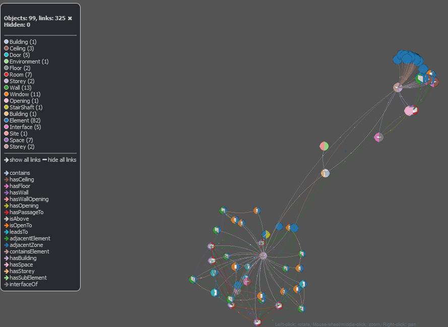

### Query - Find the rooms of a given storey:

Example query to find storeys of a given building, where "http://stackv2.com/training/ac20/ifc-2hQBAVPOr5VxhS3Jl0O47h" is 
the identifier of the building node/avatar/Digital Twin:

```json
{
  "query": [
    {
      "$domain": "http://stackv2.com/training/ac20/",
      "$iri": "http://stackv2.com/training/ac20/ifc-2hQBAVPOr5VxhS3Jl0O47h",
      "->http://elite.polito.it/ontologies/dogont.owl#contains": "storey"
    },
    {
      "$alias": "storey",
      "$classes": "https://w3id.org/bot#Storey"
    }
  ],
  "view": {}
}
```

<details>
  <summary>Answer:</summary>
  
  ```json
{
  "query": [
    {
      "$domain": "http://stackv2.com/training/ac20/",
      "$iri": "http://stackv2.com/training/ac20/ifc-2eyxpyOx95m90jmsXLOuR0",
      "->http://elite.polito.it/ontologies/dogont.owl#contains": "room"
    },
    {
      "$alias": "room",
      "$classes": "https://w3id.org/bot#Space"
    }
  ],
  "view": {}
}
```
</details>

### Query your own dataset 

**Before making changes to your dataset below, try to use what you've learned so far to query your own dataset and 
make some basic filtering with the query engine.** 

### Adding a storey to your own building

First let's create the storey:

```json
{
    "_iri": "http://stackv2.com/training/simpleBuilding/Storey_3",
    "_classes": ["https://w3id.org/bot#Storey"]
}
 ```

Swagger:
> /avatars/

In Postman :
> singlePostAvatar JSON
    
Add the storey to the building :

First find the "__uuid_" of the building. It's a property of the building's avatar.
> ex: 0aba42b6-0f4e-55e3-908b-5b1eec1d3f4a

To update the building node use the following path in swagger:
> /avatars/update/set/{uuid}

or in Postman:
> Part 1/Avatars Injection/update SET


```json
{
	"_iri": "http://stackv2.com/training/simpleBuilding/<yourname>/Small_Building",
	"_outE": [
      {
		"_label": "https://w3id.org/bot#hasStorey",
		"_targetIRI": "http://stackv2.com/training/simpleBuilding/<yourname>/Storey_3"
	  }
    ]
}
```


Now that the third Storey is created, try to update the relationship between the storeys to add the
http://orange-labs.fr/fog/ont/building.owl#isAbove relationships between Storeys, along with their
dismantleTime property (the property should be on the relationship, not the storey !).

The resulting structure of your building should look like this : 

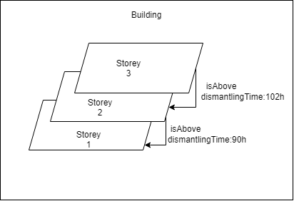

The corresponding graph in Thing'in should look like this:

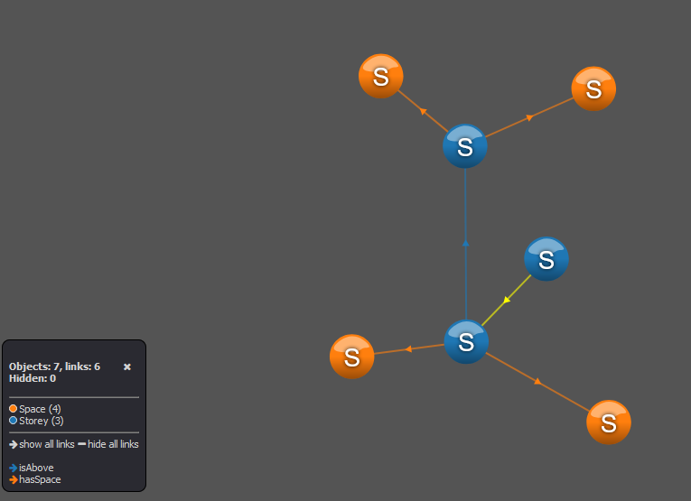

Clicking on the "isAbove" relationship, we can see the dismantle property on the right panel:
	
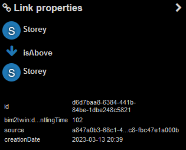
    

### Aggregation query

Below is an example aggregation query. This query aims to compute the time it would take to dismantle the building, 
where the relation of type "http://orange-labs.fr/fog/ont/building.owl#isAbove", have a property of time express in hours. 
The query makes the sum of the value of the property of type "bim2twin:dismantlingTime".

The query reads as follow:
_Find all avatars `a` such as `a` is above `b`. 
Using the relationship between `a` and `b`, noted `b_e` (e for edge), compute the sum of all their bim2twin:dismantlingTime propeties_
```json
{
  "query": [
    {
      "$alias": "a",
      "$domain": "http://stackv2.com/training/simpleBuilding/thomasHassanEx",
      "->http://orange-labs.fr/fog/ont/building.owl#isAbove": "b"
    },
    {
      "$alias": "b_e",
      "$sum": {
        "$property": "bim2twin:dismantlingTime",
        "$alias": "totalTime"
      }
    }
  ]
}
```
If you want to run this query on your dataset, replace 'thomasHassanEx' with the `<yourname>` variable

Aggregation queries must be run using the `findAggregate` verb. 
With swagger use:
> /avatars/findAggregate/

With postman use:
>  find AGGREGATE
    
### Geographic queries

`Digital Twins` may have geographic coordinates attached to them, as a property. 
Standard such as GeoJSON are used to encode geographic information in Thing'in. 

The data presented below looks like this (you will be able to run the queries below to have the same output):

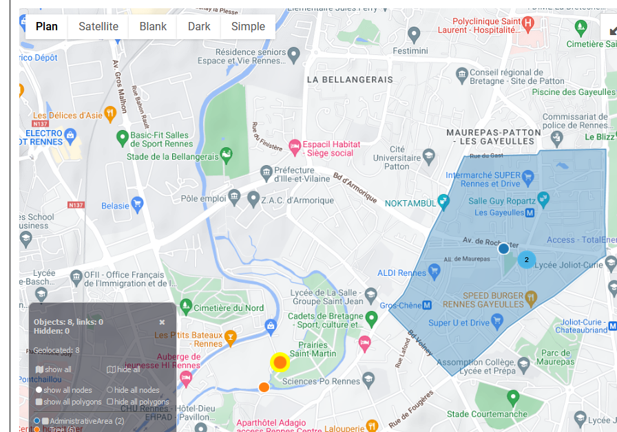
    

The following queries require avatars to have geographic coordinates.
The first query example below reads: "_given the Avatar `Arbre` (i.e. Tree), which has a geographic coordinate attached to it, 
finds avatars in the same `domain` with an attached geographic area/polygon that contains `Arbre`_":

```json
{
  "query": [
    {
      "$alias":"Arbre",
      "$iri":"http://www.thingin.com/rennes/polygon/tree_17683"
    },
    {
      "$domain": "http://www.thingin.com/rennes/polygon/",
      "http://www.opengis.net/gml/pos/polygon": {
        "$geoContains": {
          "$alias":"Arbre"
        }
      }
    }

  ],
  "view": {}
}
```


Given the geographic position of an avatar, you could also find avatars nearby in a radius of 100 meters as follows:
```json
{
  "query": [
    {
      "$alias":"Arbre",
      "$iri":"http://www.thingin.com/rennes/polygon/tree_17683"
    },
    {
      "$domain": "http://www.thingin.com/rennes/polygon/",
      "http://www.opengis.net/gml/pos": {
        "$distance": {
          "$alias":"Arbre",
          "$lte":100
        }
      }
    }

  ],
  "view": {}
}
```

Of course, this is only a sample and things could get a little more crowded:
**Administrative areas of the 76 department**


**Open Street Map data extraction depicting urban data in the center of Rennes**
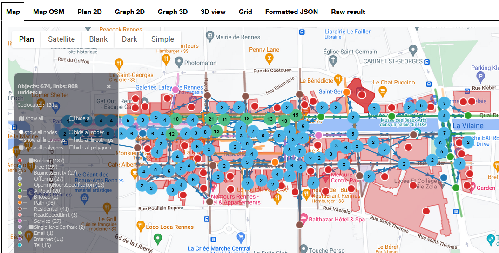
Equivalent query:
```json
{
  "query": {
    "$domain": "http://thingin.orange-labs.fr/openstreetmapRennes/"
  },
  "view": {}
}
```
Don't forget to run the query above and familiarize yourself with the different viewers (Map, 2D graph,3D graph, Raw data)


Other geographic functionalities are described [here](https://wiki.thinginthefuture.com/en/public/Avatars_search) -> Geospatial operators
    
### Thing'in advanced functionalities
    
Thing'In the future offers an array of more advanced features for avatars such as ACLs and Security Groups, graph traversal and paths computation, 
geometry or unit conversion, avatar clusters, text-based search, data validation and data inference, etc. 
In the next part, we will cover a few of these advanced functionalities.
    
## End of part 1 
That's it for this first part, feel free to ask any question :)


# Part 2 

The objective of this part is to practice with what you've learned in the first part, and also introduce a few more advanced
parts of the API through a use case. 

Unlike the first part where you created your own isolated dataset, in this part all attendants will construct a common graph. 
This graph will consist of the people in this room, along with other information. 

Instructions should now be given orally to constitute different teams. 


### Dataset creation

Dataset initialization (already done)
	
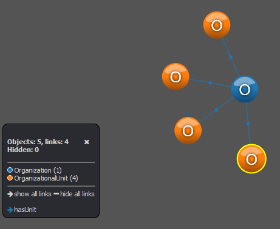

The teams that you have constituted are already present in a partially made graph. 
This graph is in the domain `http://www.stackv2.com/training/`.
Visualize the graph through the portal by making a query on this domain.

The target graph that we'd like to achieve in this part should look like this:

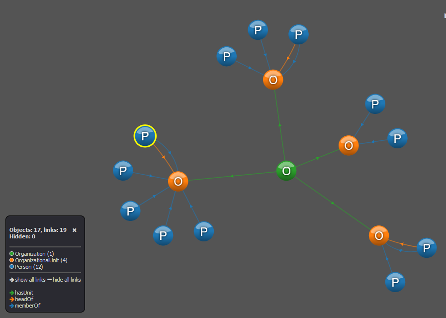

This graph makes use of the organization ontology to model the teams you've constituted (green,blue,yellow,red).
Each team corresponds to a node in the graph with a few properties (name of the team, metadata e.g. iri and uuid).


All teams are attached to a common node that represents our whole "Organization" of this session. 


### Assignment 1
Your first objective will be to complete this graph with a node representing yourself. 
To do that, you will use two well-known ontologies :
- the organization ontology (http://www.w3.org/ns/org#). See https://www.w3.org/TR/vocab-org/ 
- the Friend of a friend (Foaf) ontology (http://xmlns.com/foaf/0.1/). See http://xmlns.com/foaf/0.1/ 

Create the node representing yourself. This node should use:
- The foaf:Person class
- The foaf:family_name property
- The foaf:firstName property
- The foaf:name property that should contain your whole name
- The foaf:age property (http://xmlns.com/foaf/0.1/age). If you don't agree to share it, use a number of your choice :)

Since we work on a common graph, on top of these use-case specific propeties, you should make sure to add the following to each node you create:

RDF:
```ttl
<http://www.example.com/myAvatar> <http://orange-labs.fr/fog/ont/iot.owl#visibility> "0"^^xsd:int.
```

JSON:
```json
{
  "_iri": "http://www.example.com/myAvatar",
  "_domain" : "http://www.example.com/",
  "http://orange-labs.fr/fog/ont/iot.owl#visibility": 0
}
```
This ensures the data you create will be visible to all other attendants. 

Usually, we don't put personal data in Thing'in. That is a good moment to talk about two advanced functionality: data expiration, and security features.
Security features will be discussed in assignment 3. Concerning data expiration, you may read the following bits of information (optional).
### Optional reading : data expiration

You may have seen that each node and relationship in Thing'in are marked with the metadata `last_updated`, and `creationDate`, as well as `expireDate` (see https://wiki.thinginthefuture.com/en/public/avatarSpecialFields) .
To ensure that your personal doesn't remain, the domain where you are creating data at this moment is marked with a fixed deletion date. 
Any data will in it will be deleted after that date (tomorrow). 
This behaviour can be set when created your domain (in the POST domain operation), or for any avatar that you create
by setting the `expire_date` header to the appropriate value. We will not demonstrate the usage further in this session.

### Assignment 2
Each person in your team should then be linked to the team node, by using the `http://www.w3.org/ns/org#memberOf` 
relationship (a.k.a object property). To do that, you can either update the foaf:Person node using the avatar/update SET instruction,
of you can add a relationship using the POST relationship (see the SWAGGER and/or ask for help for detailed instructions).

### Assignment 3 
The leader of your team that you should have elected by now should be linked to the team node. 
Since he's the leader, we will use the org:headOf relationship. Collaborate with your team to create this link as it only 
needs to be added once. 

### Assignment 4
Now that teams have updated their respective graph, we can make a few queries to the whole graph (you may try to compute a subset of these queries or work with your team to do all of them)

- Search for the head (team leader) of each team and return both the team node and the head node (use the "return" field in the JSON query)
- Search for the head of teams that have exactly 4 members. You may look at the cardinality object property query pattern here https://wiki.thinginthefuture.com/en/public/Avatars_search 
- Search for a particular member of your team using his name 
- Search for all team members above the age of 30

Aggregation queries:
- Search for the average age of all attendants
- Search for the average age of a team 

### Assignment 5 : securing our data from other teams
Since we have some sensible data to protect from other teams and from the world, we will try to put in place some 
security rules. 

We will create an Access Control List that will contain all the `Person` avatars. 
We could also create a Security Group to hold team-specific rules, but we will keep things simple in this session.

The ACL documentation is available [here](https://wiki.thinginthefuture.com/en/public/Security_and_confidentiality)

The ACL that we want to create will hide all information about the other teams and your other team members, except for you 
and your team leader who should see all persons in his team.


In each team, collaborate based on the documentation to create the ACL object which contains this rule, and link each Person node 
to this ACL. 

After this process is done, you should only see your own node and the teams/organization.
If you are the team leader you should see your whole team but not the other teams.


### Assignment 6 : going further... 

This section can be investigated with the remaining time at the end of the session.
There are many things additional things already provided in the API, and more to come, 
so feel free to ask any question, in particular if you wonder if Thing'in could be of help in one of your use cases.


#### Additional material #1 : Blobs (Binary large objects)

`Digital Twins` can be attached to one or more [Blobs](https://wiki.thinginthefuture.com/en/public/Manipulate_blobs) (i.e. files).
Thing'in provides cloud-based Blob storage (backed by AWS S3).  This can be useful in several use cases.
For example, a sensor produces data that cannot be encoded through the graph or should be kept in an external system. 
We show below a basic example of how to create a blob and attach it to an avatar, then retrieve or delete it.
    
**Create a blob.**
With swagger, use 
>/blobs/

With postman, use 
> post BLOB

When using the swagger, you can simply use the UI to select a file.
For the other parameters : 
- description is indicative, optional
- tags are indicative, optional
- visibility can be set to 0 (public) or 255 (private, default)
    
As for avatars, the response includes the `$uuid` which we can use to retrieve it, delete it, or link the blob to an avatar.
    

**Link to an avatar**
We will not cover how to create an avatar again, refer to the previous section of the tutorial or use an existing avatar you have created, you will need either its IRI or its UUID.

With swagger, use 
>/blobs/link/

With postman, use 
> link BLOB to avatar
    
In Postman, you don't need to copy and paste the `$uuid` of the blob from the blob creation response, a post-request script handles that for you and fills the following Delete/Get requests. 
    
**Retrive a blob**
With swagger, use 
>GET /blobs/{uuid}

With postman, use 
> get BLOB
    
**Delete a blob**
    
With swagger, use
> DEL /blobs/{uuid}
    

With postman, use 
> delete BLOB


### Additional material #2 : injecting "massive" datasets 

On top of using the simple CRUD APIs (/avatars, /batch/avatars), Thing'in provides different ways to inject 
bigger datasets. 

Motivation :the previously used ways to create data are limited:
- both are **synchronous** : the client posts his request and then has to wait for the response
- because of the synchrnonous aspect, a timeout will be sent to the client if the data takes to long to load
- going from a completely different data format, such as an IFC file description of a building to JSON, requires pre-processing, which is a common ETL step

For these reasons it is also possible to inject data with:
- The ASYNC batch API
- Generic Injectors (from csv files, i.e. tabular data)
- Specific Injectors: these injectors are dedicated to a particular use case / domain-specific
- using Apache Nifi

Below we show an example usage of the IFC specific injector. This injector translates an IFC BIM description 
to a graph-based topology description of the building. This is reminiscent of the dataset that you created by hand 
in the Part 1 (it uses the same ontology, BOT)

### Creation of the dataset

#### Presentation of building-specific injectors

The building dataset presented in Part 1 was injected using a specific IFC injector,
which translates IFC files to a graph structure. 


There exist two types of injector to upload ifc files:
* Ifc file to Dogont ontology:
    * This injector will only inject the topology of the building using both DogOnt and Bot ontologies
* Ifc file to Ifc ontology:
    * This injector will inject the ifc according to the ifc ontology

Both injectors can be found under "Provide" > "specific injector".

An example dataset can be found under "Explore" > "Explore Thing'in database".
Then select the request "AC20 - Topological injection" query to visualize it.

The original ifc file can be found in this repository in:
> dataset/AC20-FZK-Haus.ifc

To do the same injection, you can post this file using the menu "Provide" > "Specific Injectors", in the domain of your choice. 

### Additional Material #3 : Digital Twin synchronization

We have shown above a minimal and manual update example for a single `Digital Twin`/`avatar`. 
In a more realistic system with frequent, automatic updates, this would be done 
programmatically. Thing'in provides a dedicated module/enabler to extract data 
from an IoT platform, and update Thing'in Digital Twins at a set frequency. 


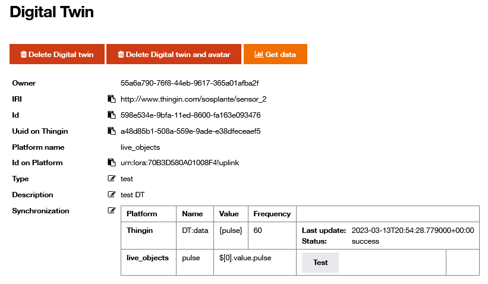


This will not be covered in this session, but if you are interested in composing a real 
Digital Twin with bi-directionnal updates, you can take a look at thje documentation [here](https://wiki.thinginthefuture.com/en/public/DigitalTwinModule)


### End of part 2 

Thank you very much for reading all the way to the end, and hoping this session gave you ideas on how to solve problems with Thing'in the future
